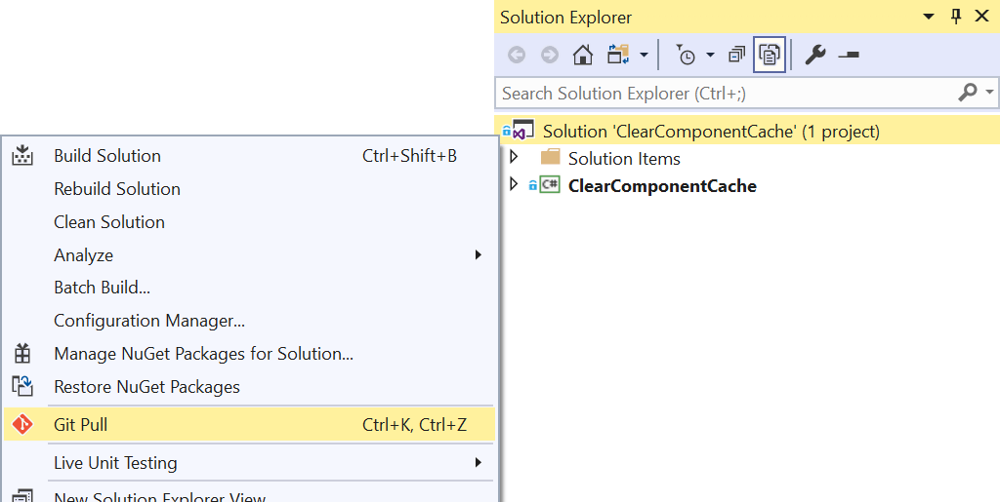
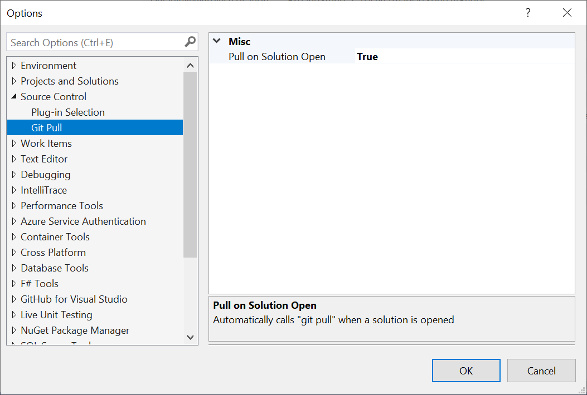
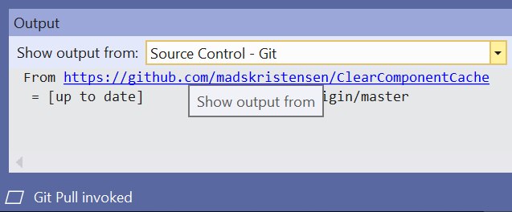

# Git Pull command for Visual Studio

Download the extension from the [Visual Studio Marketplace](https://marketplace.visualstudio.com/items?itemName=MadsKristensen.GitPull) or get the latest [CI build](http://vsixgallery.com/extension/c71355fb-bd6f-4235-a3b0-0ebaa2bad36f/)

--------------------------------------

Always stay-up-to date with the latest commits to your source code repositories and avoid push conflicts.

## Manual Git Pull
This extension exposes the "git pull" command on the context menu of the solution node in Solution Explorer. The same command is also available using the keyboard short cut **`Ctrl+K, Ctrl+Z`**.

## Automatic Git Pull
The extension can also invoke "git pull" automatially when a solution opens. The extension will load on a background thread when the first solution is being opened. It does so with little to no impact to solution load performance.

This can be enabled in the **Tools -> Options** dialog as illustrated below.

> When this setting is set to `false`, the extension is not being loaded at all. Only when the command is manually invoked will the extension load.

## Visual confirmation
The Output Window will show the information about the `git pull` command.

## License
[Apache 2.0](LICENSE)